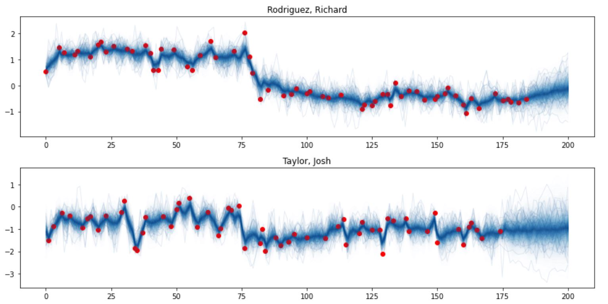
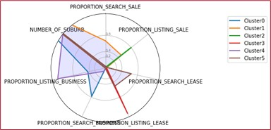
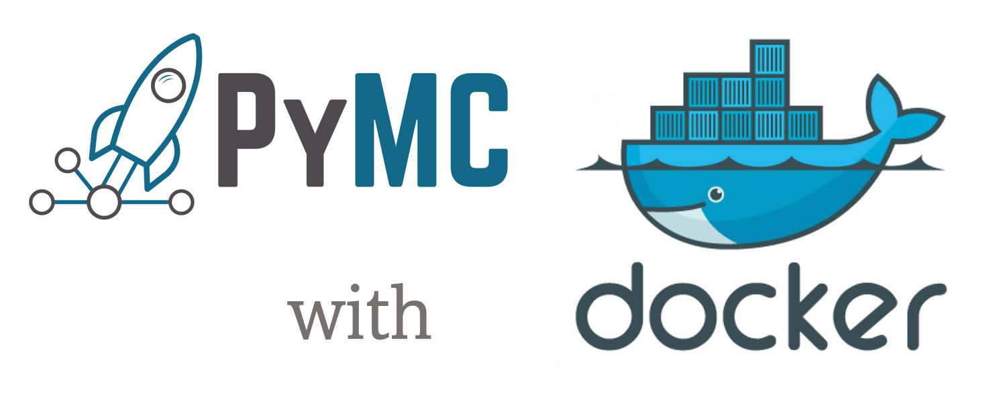
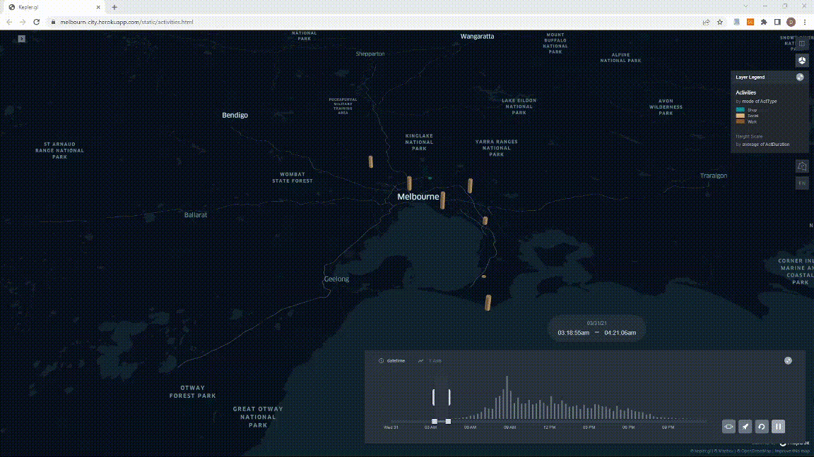
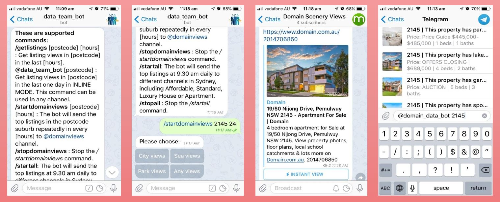

Recent projects:

## Machine Learning

### Multi-output Gaussian Processes in PyMC 

Multi-output Gaussian processes (MOGPs) have recently become an active research topic in machine learning’s multi-task learning. The advantage of multi-output GPs is its capacity to simultaneously learn and infer many outputs which have the same source of uncertainty from inputs. 

This project aims to add support for multi-output GPs in PyMC. This feature would significantly extend the capabilities of this important module, and benefit the PyMC community.

---

### Customers persona clustering

The goal of this application is to identify the critical groups of users. It will categorise users into different segmentations and try to map these groups with existing Personas.
The dataset, which is Google Analytics data of a website in the last 12 months, has more than billion rows and hundred columns. 
In this application, I have applied SQL and Pandas for data preparation, Matplotlib for data exploration, and ScikitLearn package in Python for building models.

---

## MLOps

### Building Docker images for PyMC

I have built a docker file for PyMC v4, which is merged into PyMC project's code base.

The docker image is published on [Docker Hub](https://hub.docker.com/r/pymc/pymc/tags).

---

## Data Science

### Data Visualisation: Melbournian Daily Activities

This project visualises the daily activities of Melbournians in different areas.

---

### Domain Scenery Views - Telegram Bot

A Telegram bot in Python, which will automatically push the top listings into the Domain channel on Telegram each day. The top listings, which is derived using Natural language processing (NLP) by @Min Li, show properties with the most beautiful views like beaches, lakes, and city views. Customers can join Domain Scenery Views channel on Telegram to receive the news. Tech stack: Python, SQL, Telegram Bot API

---