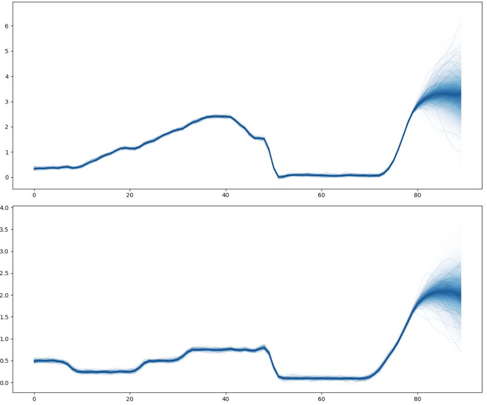
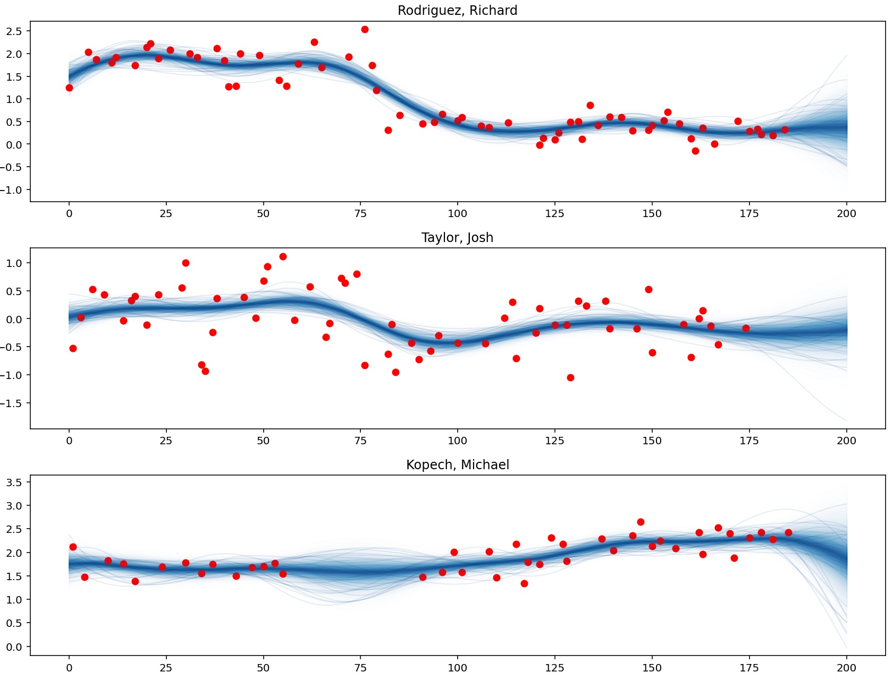
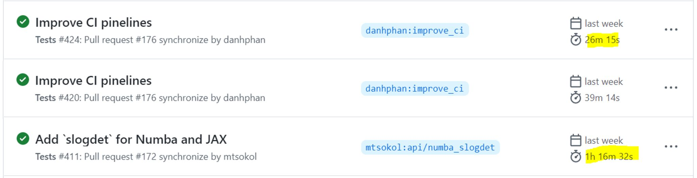

Recent projects:

## Machine Learning

### Interest rates predictions 

This project aims to predict the base interest rates in Australia, US, and UK in the coming months. 

This Google Summer of Code [project](https://summerofcode.withgoogle.com/programs/2022/projects/lKwZ8APE) aims to add support for multi-output GPs in [PyMC](https://docs.pymc.io/en/stable/api/gp.html). This feature would significantly extend the capabilities of this important module, and benefit the [PyMC community](https://www.pymc.io/blog/blog_gsoc_2022.html#danh-phan).

---

### Modelling baseball players's performance

We model the performances of different sport players by leveraging Multi-output Gaussian processes (MOGPs), which can simultaneously learn and infer many outputs which have the same source of uncertainty from inputs.

This project is the result of Google Summer of Code [project](https://summerofcode.withgoogle.com/programs/2022/projects/lKwZ8APE), which adds support for multi-output GPs in [PyMC](https://www.pymc.io/blog/blog_gsoc_2022.html#danh-phan). This feature would significantly extend the capabilities of this GP module. The following picture shows the estimated sprin rates of three top pitchers in different game dates. Please check the [PyMC example](https://www.pymc.io/projects/examples/en/latest/gaussian_processes/MOGP-Coregion-Hadamard.html) for further details.

 

---

### Aussie Social Sentiment Analysis

This project collects data from Twitter’s APIs, then cleans and stores in a sql database. The data is then used for model training and prediction of sentiment analysis for other tweets. The webapp uses Dash visualisations and is deployed on Herokuapp.

---

## MLOps

### Accelerating testing CI pipelines

Continuous Integration - Continuous Development (CI/CD) plays an essential role in MlOps and DataOps. One of the popular CI/CD tools is GitHub Actions. To enhance CI/CD pipelines, we can use the matrix strategy in GitHub Actions to run parallel tasks. 

For example, I have recently leveraged the `strategy.matrix` feature to significantly accelerate the testing CI pipelines for [PyTensor](https://github.com/pymc-devs/pytensor) from 75 mins to around 26 mins (**a 65% reduction** in running time). Please check this [pull request](https://github.com/pymc-devs/pytensor/pull/176) for further details.

---

### Building Docker images for PyMC

I have built a docker file for PyMC v4, which support both GPUs and CPUs version. The dockerfile has been merged into PyMC project's code base in this [pull request](https://github.com/pymc-devs/pymc/pull/5881).

The docker image is then published on [Docker Hub](https://hub.docker.com/r/pymc/pymc/tags), so users can easily pull the image and set up their environment.

---

## Data Science

### Data Visualisation: Melbournian Daily Activities

This project visualises the daily activities of Melbournians in different areas.

---

### Domain Scenery Views - Telegram Bot

A Telegram bot in Python, which will automatically push the top listings into the Domain channel on Telegram each day. The top listings show properties with the most beautiful views like beaches, lakes, and city views in Australia cities. Customers can join Domain Scenery Views channel on Telegram to receive the news.

---

For more projects, please check my [github@danhphan](https://github.com/danhphan).