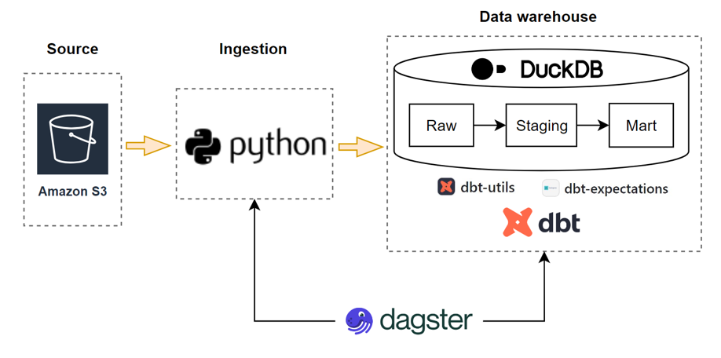
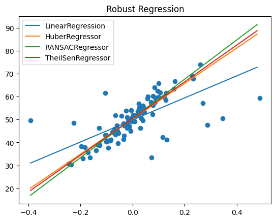

Related talks:

### Building 3D Trusted Data Pipelines With Dagster, Dbt, and Duckdb

PyCon Australia, Aug 2023

This talk will demonstrate an example of building trusted data pipelines with 3D packages: Dagster, Dbt, and Duckdb. First, it presents the importance of trusted data pipelines by testing data quality. It then discusses what we need to test data quality, from high levels (like tables, relations, …) to low levels (like rows and columns). After that, I will show how to implement these tests using different Dbt packages like dbt-utils and dbt-expectations.

Link: [https://2023.pycon.org.au/program/trusted-data-pipelines/](https://2023.pycon.org.au/program/RY9ZCY/)

Recording: [https://www.youtube.com/watch?v=jAb0T3cDcd0](https://www.youtube.com/watch?v=jAb0T3cDcd0)

*Data pipelines and architecture*

---

### Multi-output Gaussian processes (MoGPs) with PyMC

PyMCon Web Series, Feb 2023

The talk aims to get users quickly up and performing gaussian processes (GPs), especially multi-output GPs using PyMC. Several examples with time-series datasets are used to illustrate different GPs features. This presentation will allow users to leverage GPs to analyze their data effectively.

The following picture shows the estimated sprin rates of three top pitchers in different game dates. Please check the [PyMC example](https://www.pymc.io/projects/examples/en/latest/gaussian_processes/MOGP-Coregion-Hadamard.html) for further details.

Link: [https://pymcon.com/events/gaussian-processes-introduction](https://pymcon.com/events/#an_introduction_to_multi-output_gaussian_processes_using_pymc)

 

---

### An introduction to Probabilistic Programming in Python

ECSS conference, Nov 2022

This talk introduce the Probabilistic Programming, which inlucde various regression approaches using different Python packages.

---
